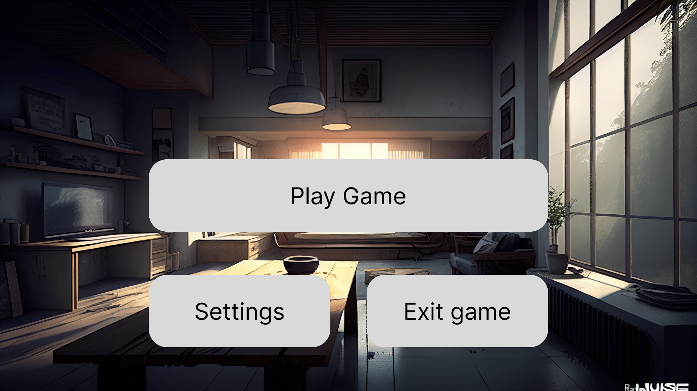
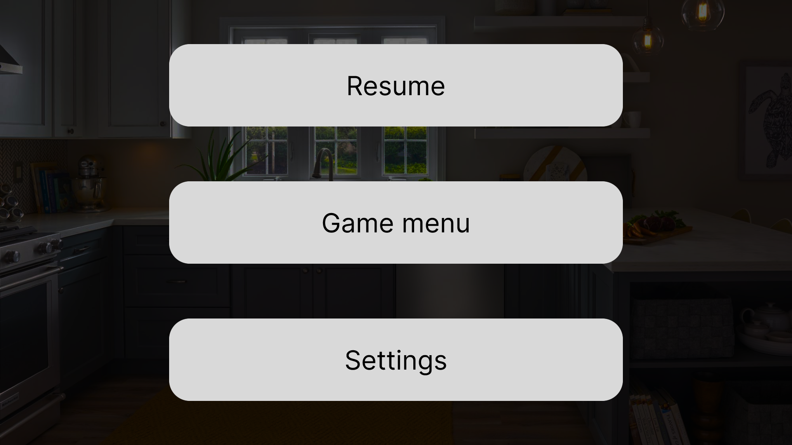

# **Functional Specifications**

Table of contents

* [Introduction](#introduction)
* [Objectives](#objectives)
* [Requirements](#requirements)
* [Functionalities](#functionalities)
* [Non-functional Requirements](#non-functional-requirements)
* [Personas](#personas)
* [Use cases](#use-cases)
* [Testing](#testing)
* [Risks](#risks)
* [Competitors](#competitors)
* [Glossary](#glossary)

## Team members

| Members         | Roles             |
| --------------- | ----------------- |
| [Malo Archimbaud](https://github.com/Malo-Archimbaud)		| Project Manager	|
| [Guillaume Riviere](https://github.com/Guillaume-Riviere)	| Tech Lead			|
| [Quentin Clement](https://github.com/Quentin-Clement)		| Software Engineer	|
| [Paul Maris](https://github.com/PaulMarisOUMary)			| Quality Assurance	|
| [Laurent Bouquin](https://github.com/laurentbouquin)		| Program Manager	|

## Introduction

### Project Description

The goal of this project is to create an innovative game ( the genre and the theme are free ) using [Unreal Engine 4.27](https://www.unrealengine.com/en-US/blog/unreal-engine-4-27-released). We may choose a platform for the game to run on (PC, mobile, console, etc.) and we have multiple milestones to reach:

| Milestone | Description | Date |
| --------- | ----------- | ---- |
| [Milestone 1](https://github.com/algosup/2022-2023-project-4-game-design-Team-5/milestone/1) | Create a One-Sheet Document | 2023-03-03 |
| [Milestone 2](https://github.com/algosup/2022-2023-project-4-game-design-Team-5/milestone/2) | Create a prototype of the game | 2023-03-10 |
| [Milestone 3](https://github.com/algosup/2022-2023-project-4-game-design-Team-5/milestone/3) | Create a playable version of the game for a demo | 2023-03-24 |
| [Milestone 4](https://github.com/algosup/2022-2023-project-4-game-design-Team-5/milestone/4) | Create a final version of the game to present | 2023-04-14 |

### Game Description

Each sugar cube as only one duty, to sweeten a coffee. You will follow the adventures of Sube, a sugar cube, that has been thrown away by mistake and is now trying to go into the coffee. Help Sube navigate through obstacles and reach the coffee cup.
You will be able to go through countless adventures and levels with Sube all around the house to find the cup and finally sweeten the coffee. Sube will be able to use the environment to his advantage to reach the cup, but be careful, there are things that a sugar should not approach.

## Objectives

For this project, the main objectives are:
- Create a game using Unreal Engine 4.27.
- Create a game that is fun to play.
- Create a game that is easy to use.
- Have a game with original mechanics.
- Push the limits of our capabilities with Unreal Engine during the period of time we have.

## Requirements

- We must use Unreal Engine 4.27.
- We must have a playable version of the game by the end of the project.
- We must have a game that gives the player a good experience.

## Functionalities

### Main Menu
The main menu will be the first menu that the player will see when he starts the game.
In this menu, the player will have the choice to start the game or to quit the game.

Here is the first version of the main menu of the prototype:

### Pause Menu

The Pause menu will be the menu that will appear when the player will pause the game and will allow the player to resume the game, go to the main menu or quit the game.

Here is the first version of the pause menu from the prototype:

### Mechanics

The mechanics of the game will be the following:

| Mechanic's name | Description |
| -------------- | ----------- |
| **Deadly objects** | The player will have to avoid some obstacles that will kill him if he stays too long close to it. ( e.g. water, heat, etc...) |
| **Sticky** | The player will have to use the sticky mechanic to be able to stick to allowed walls to cross gaps between places. |
| **Catapult** | The player will have to use objects that allow him to launch himself. |
| **Portals** | The player will have to use one-way portals to be able to teleport himself. |

## Non-functional Requirements

- The game will be solo-player only.
- The game will be in 3D.
- The game will be in English.
- It will work on Windows.

## Personas

<ins>Name:</ins> Jean  
<ins>Age:</ins> 76  
<ins>Bio:</ins> He's retired since few months ago but have been wondering how to entertain himself recently and wants to try a new game.  
<ins>Favorite game genre:</ins> Not defined for the moment  
<ins>Type of player:</ins> Will play for fun  

<ins>Name:</ins> Marie  
<ins>Age:</ins> 25  
<ins>Bio:</ins> She is a student and is looking for a new game to play during her free time.  
<ins>Favorite game genre:</ins> Fantastic  
<ins>Type of player:</ins> Will try to finish the game slowly  

<ins>Name:</ins> Charles-Henri  
<ins>Age:</ins> 35  
<ins>Bio:</ins> He is a worker and is looking for another game that would be fun to play.  
<ins>Favorite game genre:</ins> Action  
<ins>Type of player:</ins> Will get easily frustrated and bored   

<ins>Name:</ins> Paul  
<ins>Age:</ins> 17  
<ins>Bio:</ins> He his a student and wants to find a game to play during his holidays.  
<ins>Favorite game genre:</ins> Adventure  
<ins>Type of player:</ins> Will try to finish the game at 100% as fast as possible  

## Use cases

The use cases that will be presented here will be the cases where each persona will use the game.
Each use case will be considered as having these steps already done:
- The player has run the game.
- The player has started the game.

### Use case 1: Jean

Jean would listen carefully to the instructions given by the narrator to understand how he has to play the game. He would slowly try to reach the coffee cup. His goal would be to have fun playing the game and would probably search on the internet for the solution to the levels if he gets stuck. Once he has finished the game, he would probably search for another game to play.

### Use case 2: Marie

Marie would not really pay attention to the narrator and would try to understand the mechanics all by herself. She would try to look everywhere to look at the graphics of the game. She would probably try to find the solution to the levels by herself and would not search on the internet if she gets stuck. Once she has finished the game, she would certainly play it again to try to find all the secrets but would quickly search for another game to play.

### Use case 3: Charles-Henri

Charles-Henri would try to understand all the things the narrator explained before even trying to move and would be very careful when he would play the game. He would probably try to find the solution to the levels by himself and would not search on the internet if he gets stuck. When he has finished the game, he won't try to play it again as he would get bored playing it again.

### Use case 4: Paul

Paul would not really pay attention to the narrator and would try to understand the mechanics all by himself. He would try to look for every hidden secret in the game. He won't search anything on the internet and try to find the solution to the levels by himself. When he has finished the game, he would try to do all the game in less time than the first time he played it.

## Testing

The team members will test the game during the conception and after the beginning of the game. The game will be tested by the client and the stakeholders at the end of the project.

## Risks

- The finished game may be too heavy for low configuration computers.
- We won't be able to finish the game in time.

## Deliverables

- <ins>A One-Sheet Document:</ins> A document that contains the main information about the project ( Platforms, Target groups/Age, Game summary, Game outline, Unique Selling Points, Similar competitive products, Artwork ).
- <ins>A prototype of the game:</ins> A presentation of the level design and the mechanics of the game for the client to see if the game is going in the right direction.
- <ins>A playable version of the game:</ins> A playable version of the game that would be used for a demo to show the client the progress of the game.
- <ins>A final version of the game:</ins> A final version of the game that would be used to present the game to the client.

## Competitors

## Glossary

- **Sticky:** A mechanic where the player can stick to pre-defined parts of the walls.

- **Catapult:** A mechanic where the player can launch himself from one point to another.

- **Portals:** A mechanic where the player can enter from a hole and exit from another one.

- **One-Sheet Document:** A document that contains the main information about the project ( Platforms, Target groups/Age, Game summary, Game outline, Unique Selling Points, Similar competitive products, Artwork ).

- **Game Design Document:** A document that contains the main information about the game ( Gameplay, Engine, Art, Sound, Level Design, etc. ).

[Go back to the top ^](#functional-specifications)