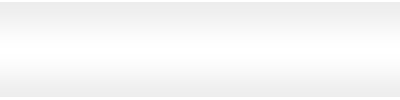

Table of content

- [General](#general)
  - [Introduction](#introduction)
- [Requirements](#requirements)
  - [Unreal Engine](#unreal-engine)
  - [Github](#github)
- [Convention](#convention)
  - [Naming](#naming)
  - [Folder / File](#folder--file)
  - [Blueprint](#blueprint)
  - [Git](#git)
    - [Branch](#branch)
    - [Commit](#commit)
    - [Pull Request](#pull-request)
    - [Issue](#issue)
- [Asset](#asset)
  - [Environment](#environment)
  - [Character](#character)
    - [Sube](#sube)
    - [NPC](#npc)
  - [Plugin](#plugin)
- [Gameplay](#gameplay)
  - [Objective](#objective)
  - [Camera](#camera)
  - [Mechanics](#mechanics)
    - [Movement](#movement)
    - [Obstacle](#obstacle)
    - [Sticky](#sticky)
    - [Catapult](#catapult)
    - [Teleport](#teleport)
    - [Death](#death)
      - [Death by falling](#death-by-falling)
      - [Death by water](#death-by-water)
      - [Death by heat](#death-by-heat)
    - [Discuss](#discuss)
  - [UI](#ui)
    - [Main Menu](#main-menu)
    - [Pause Menu](#pause-menu)
    - [HUD](#hud)
    - [Dialogue](#dialogue)
      - [Help Dialogue](#help-dialogue)
      - [Lore Dialogue](#lore-dialogue)
  - [Audio](#audio)
    - [Music](#music)
  - [Animation](#animation)
    - [Sube](#sube-1)
    - [Catapult](#catapult-1)
    - [Teleporter](#teleporter)
  - [Cutscene](#cutscene)
    - [Intro](#intro)
- [Level](#level)
  - [Level Design](#level-design)
  - [Lighting](#lighting)
- [Softwares](#softwares)
  - [Unreal Engine](#unreal-engine-1)
  - [Epic Games Marketplace](#epic-games-marketplace)
  - [Visual Studio](#visual-studio)
  - [Git](#git-1)
  - [Blender](#blender)

# General

## Introduction

The goal of this document is to define the technical specifications of the project.
It will be used to define the requirements and the conventions of the project.
As well as the tools we will use.

# Requirements

## Unreal Engine

We must use Unreal Engine 4.27.

## Github

We must use Github to manage our project.
We also need to expand storage space for our project ( due to the size of the assets ).

- Perforce doesn't solve the problem (Files still to big for Github).
- Self-hosted Gitlab doesn't solve the problem (Won't appear on Github).
- Self-hosted Github doesn't solve the problem (Won't appear on Github).
- Private External SSD doesn't solve the problem (Won't appear on Github and limit to 1 person working).

# Convention

## Naming

Folders, files, Class, functions, variables must be named in English and in Pascal Snake Case.
Everythings must be in English and have a meaningfull name.

## Folder / File

Imported assets will be in their own folder.
Created blueprints will be in 'Blueprint' folder.
Created materials will be in 'Material' folder.
Created textures will be in 'Texture' folder.
Created animations will be in 'Animation' folder.
Created sounds will be in 'Sound' folder.

## Blueprint

Blueprints must be named in English and in Pascal Snake Case.
They will be in the 'Blueprint' folder. Except for blueprints imported with an asset.

## Git

### Branch

Each branch must be named in English and have a meaningfull name.
There will be a branch for:

- The main branch
- MVP Branch
- Demo branch
- One for each functionnalities

### Commit

Each commit must be named in English and have a meaningfull name.
Multiple commits can be done in one branch.
Commit as much as possible, it will help us to keep track of the changes.
You can commit not working code, as long as it's not pushed.

### Pull Request

Each pull request must be named in English and have a meaningfull name.
Each pull request must be reviewed and approved by at least one other person.
Each pull request must be merged by the person who created the pull request.
Each pull request must have a description of the changes made.

### Issue

Each issue must be named in English and have a meaningfull name.
Each issue must be assigned to a person.
Each issue must have a description of the problem (c.f [Issues](https://github.com/algosup/2022-2023-project-4-game-design-Team-5/issues)).

# Asset

## Environment

The house asset is from the Unreal Engine Marketplace. It is a triplex house with a lot of rooms and a garden. The asset is free to use for non-commercial projects. The asset is available [here](https://www.unrealengine.com/marketplace/en-US/product/big-triplex-house-villa).
It's already made and we can use it as a base for our game.
All materials and textures are already made and applied to the asset.

## Character

### Sube

Sube is the main character and is a sugar cube.
For the MVP, Sube will be a simple cube with a material of sugar applied to it.
For the final version, Sube will be a 3D model of a sugar cube with a material of sugar applied to it. It will have to be designed by us on Blender.

### NPC

Npc are going to be other sugar cubes that will be used to interact with the player.
It may be used to give the player a hint or lore about the game.
For the MVP, Npc will be a simple cube with a material of sugar applied to it.
For the final version, Npc will be a 3D model of a sugar cube with a material of sugar applied to it. It will have to be designed by us on Blender.

## Plugin

Gravity change plugin is a plugin that allows us to change the gravity of the player. It is available [here](https://www.unrealengine.com/marketplace/en-US/product/directional-planet-gravity). It is free to use for non-commercial projects. It will be used for the sticky functionnality.

# Gameplay

## Objective

The objective of the game is to reach the cup of coffee. The cup of coffee is the end of the game.
The game will be separated in levels. Each level will move the cup of coffee further away from the player.

## Camera

## Mechanics

Each mechanic will be explained in details here.

### Movement

The player will be able to move on 2 axis (X / Y by default).
The player will be able to move at a constant speed.
The player will be able to move in 4 directions (Up / Down / Left / Right).
Each direction will be mapped to a key.

- Forward: Z
- Backward: S
- Left: Q
- Right: D

Each key when pressed will trigger a movement in the corresponding direction.
The will also trigger the associated animation for the cube to move.
While the cube is moving, any other interractions will be disabled to avoid unwanted behavior.

### Obstacle

Obstacles will be placed in the level to prevent the player from reaching the cup of coffee.
Obstacles will be items integrated in the environment and might take any forms ( Wall, plate, etc. ).
Each obstacle will have a collision box for the player to not glitch through it.
Each obstacle will have a material to make it visible.
Each obstacles placement and details will be define in the [Level section](#level).

### Sticky

Sticky will be a mechanic that will allow the player to stick to walls.
It will be shown as a green particle effect on the wall as if the wall was dirty.
It will activate when the player enter a special zone.
And will stay activated as long as the player stay in that zone and follow the predefined path.
The controls stay relative to the camera.
It means old controls become as follow:

- Forward: Z -> Forward
- Backward: S -> Backward
- Left: Q -> Down
- Right: D -> Up
  
If the player is sticked to a wall and decide to leave the predefined path, the sticky mechanic will be deactivated and the player will fall resulting in a death.

### Catapult

Catapult will be a mechanic that will allow the player to launch itself in the air.
It will be represented as a spoon.
It will activate when the player enter the back of the spoon.
It will launch the player in the direction of the spoon from point A to point B.

There is no laucnh control, air control or gravity control.
The controls will be desactivated while the player is in the air.
The catapult have an animation.

### Teleport

Teleport will be a mechanic that will allow the player to teleport to a specific location.
It will be represented as mouse hole.
It will activate when the player enter the mouse hole.
It will teleport the player to the other side of the mouse hole.
The teleport will be instant.
It will be one sided ( No come back ).
It have an animation.

### Death

The player have multiple ways to die.

#### Death by falling

The player will die if he fall from a height.
For a better gameplay, the player will be teleported to the start of the level when he fall from a height.

#### Death by water

The player will die if he fall in the water.
The player will be able to stay for a maximum of 3.00 seconds in the water before dying.
This obstacle will be represented as a water puddle.
To have the most realistic gameplay, the water will have to be placed on a straight surface.
To keep the gameplay fluid, the player will be teleported to the start of the level when he fall in the water for more than 3.00 sec.

#### Death by heat

The player will die if he stay in the heat for more than 5.00 sec.
This obstacle will be represented as a light.
To keep the gameplay fluid, the player will be teleported to the start of the level when he stay in the heat for more than 5.00 sec.

### Discuss

The player will be able to discuss with other sugar cubes found on his path.
The discussion will be triggered when the player enter a specific zone and press the interaction Key ( E ).
The discussion will be represented as a text box.
The discussion will be triggered by the player and will be a one way communication.
It will be used to give the player a hint or lore about the game.
Each discussion will be triggered by a specific NPC.
Each discussion will be unique and will depends on the level (cf [Level](#level)).

## UI

### Main Menu

The main menu will be the first screen the player will see when launching the game.
The main menu will be a simple menu with a 'Campaign' button and an 'Exit' button.
Background image:

It is generated using [MidJourney](https://www.midjourney.com/).
This image is under the license [CC BY-NC 4.0](https://creativecommons.org/licenses/by-nc/4.0/).
It's restricted to non-commercial use.
For each clickable button, there will be an asset for the normal state and another asset when it's hovered.
Idle button:

Hovered button:

Each button will be anchored to the left.
The menu will be at 30% from the top of the screen.
Buttons will be spaced by 30 pixels verticaly.

### Pause Menu

Pause menu will be accessible by pressing the escape key while in game.
The pause menu will be a simple menu with a 'Resume' button and a 'Exit' button.
The background image will be the actual game with a blur of 30%.
The menu will be at 30% from the top of the screen.
Buttons will be spaced by 30 pixels verticaly.
Each button will be anchored to the left.
For each clickable button, there will be an asset for the normal state and another asset when it's hovered.
Idle button:

Hovered button:

### HUD

The game won't have a HUD.
No data as life point, experience, etc is in the game.

### Dialogue

#### Help Dialogue

The help dialogue will be a simple dialogue box with a text.
The text will be in the middle of the box.
The box will be on the top right of the screen.
The size of the box will depends on the content of the text.
The box will be anchored to the top right.

#### Lore Dialogue

Lore dialogue are meant to give the player some lore about the game.
They are displayed as if a NPC was talking to the player.
The lore dialogue will be a simple dialogue box with a text.
The text will be in the middle of the box.
The box will be on the person who is talking.
The size of the box will depends on the content of the text.

## Audio

### Music

The music will be a simple music that will be played in the background.
It will be played in loop.
Here is the music: [Music](../Sound/Background_Music.mp3)

## Animation

All animations will be done in Unreal Engine.

### Sube

Sube will have a simple animation when he's 'walking'.
It will be a simple animation of the cube moving.
As Sube is a cube, it will be a simple animation of the cube moving from a side to another as if it was pushed.

### Catapult

The catapult will have the animation of a spoon throwing a sugar cube.

### Teleporter

The teleporter while have a screen animation.
It will fade out the game and fade in the new location.

## Cutscene

### Intro

The intro will be a simple cutscene that will show the player the story of the game.
It will be a cutscene with the human preparing a coffee.
The human will put the coffee in the machine and the machine will start to make the coffee.
The human will have a phone call and will leave the coffee.
This is when Sube will get out of the sugar bag and will start to move.

# Level

## Level Design

## Lighting

# Softwares

## Unreal Engine

We will use Unreal Engine 4.27.2. It is available [here](https://www.unrealengine.com/en-US/download).

## Epic Games Marketplace

We will use the Epic Games Marketplace to get assets. It is available [here](https://www.unrealengine.com/marketplace/en-US/store).

## Visual Studio

We will use Visual Studio 2019. It is available [here](https://visualstudio.microsoft.com/fr/downloads/).

## Git

We will use Git combined with GitHub Desktop. It is available [here](https://desktop.github.com/).

## Blender

We will use Blender 2.93. It is available [here](https://www.blender.org/download/).
